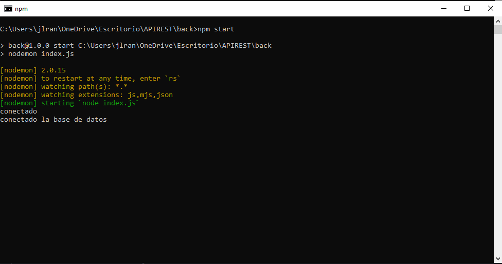
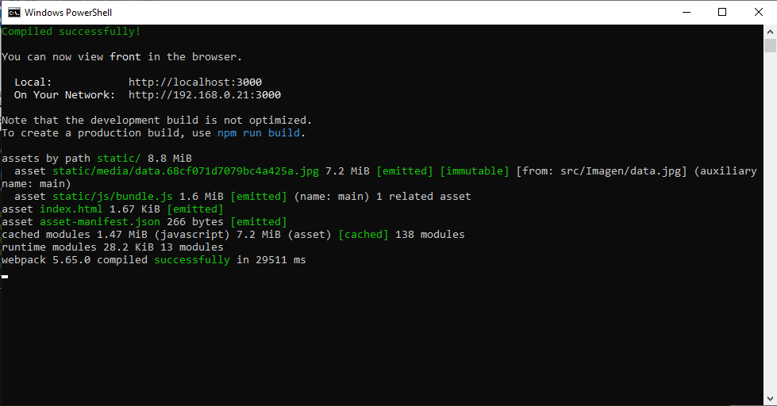

# API-RESTful-Formulario

En este proyecto se realizo con  `node.js`, una base de Datos en `PostgreSQL` con la `ORM Sequelize` por parte del back y `react`, `react-router-dom` por parte del front. Ademas se realiza el consumo de la api externa [restcountries](https://restcountries.com/) para traer el nombre de todos los paises en el formulario.

## Informacion

Para poder probar el repositorio es necesario clonarlo y hacer `npm i`  tanto en la carpeta back como en la carpeta front, ademas de crea una base de datos en postgreSQL `Create database`.

```sql
CREATE DATABASE demo;
```


luego de haber creado la base de datos solo queda hacer `npm start` tanto en el la carpeta back como en la carpeta front 






espero les ayude.